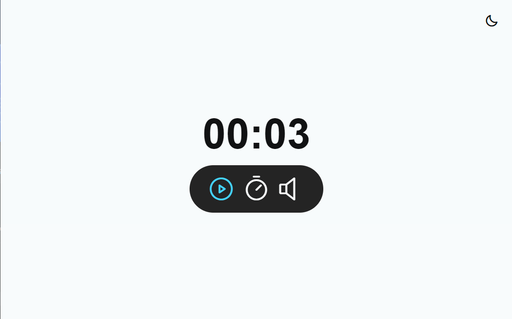
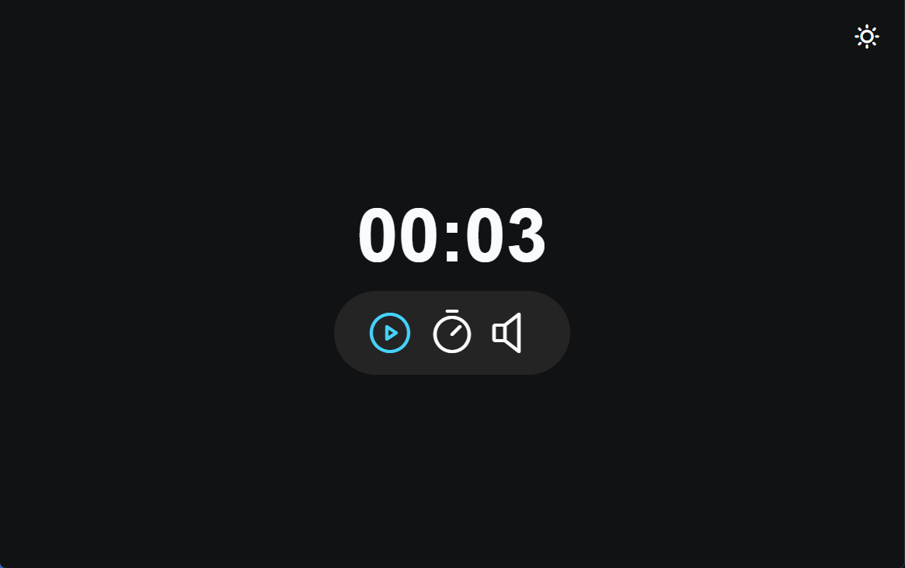

<h1 align="center">

Focus Time V3.0

</h1>

  

    

## 🚀 Technologies

This project was developed with the following technologies:

- HTML e CSS
- Module attribute JavaScript
- Factory e Injeção de dependências
- JavaScript
- Figma

## 💻 Project

Focus time V3 Pomodoro style, with Lo-Fi music.
In this project use concepts like:

- Clean Code.
- factory.
- Dependency injection.
- Mode Dark/Light

* [Access the finished project, online](https://arks-lacerda.github.io/02-focusTimePlus/)

## 🔖 Layout

Project layout [FROM THIS LINK](<https://www.figma.com/file/tVJ2o3TykpnXEldvEpXF7W/Focus-Timer-V2-%E2%80%A2-Projeto-Explorer-(Community)?node-id=1403%3A22&mode=dev>).

## 📝 License

This project is under the [MIT]() license. See the LICENSE file for more details.

## 🔎 My LinkedIn

<h3 align="center">Developed by Arthur Lacerda ☕</h3>

